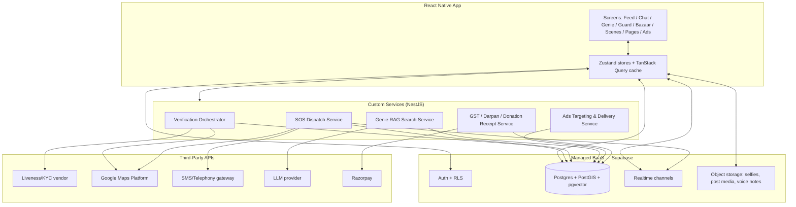

# Circle Up — Architecture

> Companion to [problemstatement.md](problemstatement.md). Defines the technical architecture for turning the CircleUp prototype into a real product.
> **Platform:** React Native (iOS + Android) · **Backend:** Hybrid (managed BaaS + custom services)

---

## 1. Architecture Principles

These follow directly from the problem statement's differentiators:

1. **Verification is a hard gate, not a feature flag.** Auth, address, liveness-selfie, and GPS verification must complete server-side before a user can read or write anything — never trust client-reported "verified" state.
2. **Proximity is structural, not a filter.** Society/Tower/Flat and geohash-based radius live in the data model itself, so every query (feed, discovery, ads targeting) is naturally scoped — not bolted on after the fact.
3. **Safety features must work when the rest of the app can't.** SOS dispatch cannot depend on the same request path as the social feed; it needs its own low-latency, high-reliability path with real telephony/SMS fallbacks.
4. **Managed services where speed matters, custom services where the product's edge lives.** Auth/storage/realtime chat are commodity — buy them. SOS dispatch, Genie AI search, and Ads targeting are the differentiators — build them.
5. **Mobile-first, offline-tolerant.** Feed and chat should degrade gracefully offline (cache last-seen data); SOS and verification require connectivity and should fail loudly, not silently.

---

## 2. Tech Stack

| Layer | Choice | Why |
|---|---|---|
| Mobile app | **React Native (Expo, bare workflow)** | Matches prototype's React mental model; bare workflow needed for background voice-trigger, custom camera overlay, and native SDKs (Expo alone won't cover Silent Phrase's always-listening requirement) |
| Styling | **NativeWind (Tailwind for RN)** | Prototype is already Tailwind-class-driven; near-direct port of existing UI code |
| State management | **Zustand** (local/UI state) + **TanStack Query** (server state/caching) | Prototype's `useState`-heavy screens map cleanly to Zustand stores per domain (auth, feed, chat, sos) |
| Navigation | **React Navigation** (native-stack + bottom-tabs) | Matches prototype's `screen`/`subScreen` state machine — direct translation to stack + modal routes |
| Auth & user DB | **Supabase** (Postgres + Auth + Row-Level Security) | Managed BaaS; RLS enforces "verified users only see their neighbourhood's data" at the DB layer, not just app logic |
| Realtime (chat, live SOS status) | **Supabase Realtime** (Postgres logical replication) or **Ably** if scale demands it later | Chat and SOS dispatch status both need push-on-change; start with Supabase, extract to Ably only if connection limits become a problem |
| File/media storage | **Supabase Storage** (S3-compatible) | Selfies, GPS-stamped photos, post images, voice notes |
| Push notifications | **Expo Push / FCM + APNs** | Standard mobile push |
| Custom backend services | **Node.js (NestJS) microservices**, deployed on **Fly.io / Railway** (small team) → AWS ECS later if scale demands | Owns: SOS dispatch, liveness verification orchestration, Genie AI search, Ads Manager/targeting, GST/Darpan compliance checks |
| Liveness / face verification | **3rd-party API (e.g., AWS Rekognition Liveness, or IDfy/Signzy for India-specific KYC)** | Do not build face-liveness detection in-house — this is a solved, regulated problem; use a vendor with Indian KYC compliance experience |
| GPS / geofencing | **Google Maps Platform (Geocoding + Places Autocomplete)**, geohash indexing in Postgres (`postgis` extension) | Address autosuggest at signup; `postgis` for "5 nearest neighbours" and radius queries |
| SMS / emergency dispatch | **Twilio / Gupshup / MSG91** (India-focused SMS gateway) for SMS fallback; native `tel:`/`sms:` deep links as prototype already does for one-tap calling | SOS must not depend solely on internet — SMS fallback matters when data is patchy during an emergency |
| AI search (Circle Genie) | **RAG pipeline**: embed neighbourhood posts/comments (pgvector in Postgres) + LLM (Claude/GPT via API) for query answering | Keeps recommendation answers grounded in real neighbour posts, not hallucinated — critical for trust |
| Ads serving & targeting | **Custom service** reading from the same Postgres geospatial index (society/radius) + a simple auction/pacing model | No need for a full ad-exchange — targeting radius and budget pacing are the only real requirements at this stage |
| Payments (donations) | **Razorpay** (India-native, supports 80G-compliant donation receipts via integration or manual receipt generation) | Required for NGO donation flow |
| Analytics | **PostHog** (self-hostable, supports mobile) | Feature usage, funnel drop-off (especially onboarding/verification funnel) |
| CI/CD | **EAS Build/Submit** (Expo) + **GitHub Actions** for backend services | Standard RN release pipeline |
| Error tracking | **Sentry** (RN + Node) | |

---

## 3. High-Level System Diagram



---

## 4. Mobile App Architecture

### 4.1 Directory structure (maps 1:1 to prototype's screen list)

```
src/
  app/                    # React Navigation route tree
    AuthStack.tsx          # Splash → Phone/Signup → OTP → Address → ProfileSetup
    MainTabs.tsx            # Home, Explore, Chats, Search, Profile
    modals/                 # CreatePost, NeighbourhoodSheet, StoryViewer, ShareProfile, etc.
  features/
    auth/                  # login, signup, OTP, GoogleAuth
    verification/           # AddressScreen, GpsCameraModal, liveness flow
    feed/                    # HomeFeed, PostCard, ReactionPicker, CreatePostSheet
    chat/                     # ChatsTab, ChatDetailScreen, NewChatSheet
    genie/                     # GenieScreen
    guard/                      # GuardScreen, SOSActiveOverlay, TrustedContacts, FakeCall, SilentPhrase, ShareLocation
    explore/                     # ExploreTab, CircleCard, discovery
    bazaar/                       # BazaarScreen
    scenes/                        # ScenesScreen, CreateEventScreen, MyEventsScreen
    pages/                          # CreatePageScreen, MyPagesScreen, PageTypeSelector
    ads/                             # AdsManagerScreen, CreateAdScreen
    profile/                          # ProfileTab, EditProfile, Achievements
    settings/
  shared/
    components/             # CircleUpLogo, GradientButton, Avatar, HumanHeart (ported as-is)
    stores/                   # zustand: authStore, feedStore, chatStore, sosStore
    api/                        # generated Supabase client + typed REST clients for custom services
    hooks/
  native/
    voiceTrigger/             # native module for Silent Phrase always-listening detection
    gpsCameraOverlay/          # native canvas/photo overlay module
```

### 4.2 Screen → service mapping (from prototype line references in problemstatement.md)

| Prototype screen | Backing service(s) |
|---|---|
| `AddressScreen`, `GpsCameraModal` | Verification Orchestrator → Liveness vendor + Maps Geocoding |
| `HomeFeed`, `PostCard`, `CreatePostSheet` | Supabase Postgres (RLS scoped to society/tower), Storage for media |
| `GenieScreen` | Genie RAG Search Service |
| `GuardScreen`, `SOSActiveOverlay`, `SilentPhraseScreen` | SOS Dispatch Service + native voice-trigger module |
| `ChatsTab`, `ChatDetailScreen` | Supabase Realtime + Storage (voice notes) |
| `BazaarScreen`, `ScenesScreen` | Postgres tables, standard CRUD via Supabase client |
| `CreatePageScreen`, `AdsManagerScreen`, `CreateAdScreen` | Compliance Service (GST/Darpan validation) + Ads Targeting Service |
| `AchievementsScreen` | Postgres triggers/materialized view on user activity |

---

## 5. Data Model (core tables)

All tables scoped by Row-Level Security to the requesting user's verified `society_id` unless explicitly public (e.g., cross-society Explore "from your city" queries use a relaxed policy with radius only, no write access).

```
users
  id, phone, email, auth_provider, name, username, bio, avatar_url,
  vibes: text[], is_verified: bool, verified_at, streak_count, points, city_rank

neighbourhoods
  id, name, city, geo_boundary (postgis polygon)

society_memberships
  id, user_id, neighbourhood_id, society, tower, flat,
  verification_status: enum(pending, verified, rejected),
  gate_photo_url, address_proof_url, verified_at, geohash

posts
  id, author_id, neighbourhood_id, category: enum(alert, buy_sell, recommend, event, lost_found, general),
  caption, media_urls[], geohash, created_at

reactions
  id, post_id, user_id, type: enum(like, notice, diss, engaged, out)

comments
  id, post_id, author_id, parent_comment_id, text, created_at

chats / chat_members / messages
  standard chat schema; messages support text/voice_note_url/image_url

sos_events
  id, user_id, triggered_via: enum(button, silent_phrase), status,
  lat, lng, accuracy, started_at, resolved_at

sos_dispatch_log
  id, sos_event_id, channel: enum(police, emergency112, women_helpline, trusted_contact, nearby_neighbour),
  recipient, sent_at, delivery_status

trusted_contacts
  id, user_id, name, phone, relation

bazaar_listings
  id, seller_id, title, price, condition, category, media_urls[], geohash, status

events
  id, host_id, title, type, starts_at, location, privacy_tier: enum(verified, close_friends, open),
  guest_limit

event_rsvps
  id, event_id, user_id, status: enum(going, maybe)

pages
  id, owner_id, type: enum(personal, business, ngo), handle, category,
  gst_number, darpan_id, accepts_donations: bool

ad_campaigns
  id, page_id, objective, status, budget, spent, target: jsonb (radius, society_ids, age_range, interests),
  starts_at, ends_at

donations
  id, page_id, donor_id, amount, receipt_url, razorpay_payment_id

genie_query_log
  id, user_id, query, answer, source_post_ids[]  -- for auditability of AI answers
```

---

## 6. Key Flows

### 6.1 Signup / Verification (hard gate)
1. Client collects phone/email/Google via Supabase Auth → issued a session, but `is_verified = false`.
2. Client calls **Verification Orchestrator** with address input → server resolves via Maps Geocoding, creates `society_memberships` row (`pending`).
3. Client captures selfie via native camera overlay module (burns GPS+timestamp into the image client-side for user-visible proof) and uploads raw photo + GPS reading to Verification Orchestrator.
4. Orchestrator calls Liveness vendor API server-side (never trust client-reported "verified") → on pass, geofences the reported GPS against the claimed society boundary (`postgis ST_Contains`) → marks membership `verified`.
5. RLS policies flip on: user can now read/write within their `neighbourhood_id`.

**Why server-side liveness matters:** the prototype's fake 2.8s "AI verification" delay must become a real, tamper-resistant check — a client that reports "verified: true" cannot be trusted since the mobile app binary is inspectable/modifiable.

### 6.2 SOS Dispatch
1. Button hold or Silent Phrase native module detects trigger → immediately creates `sos_events` row via a dedicated low-latency endpoint (not the general API gateway — separate rate limits, separate uptime SLA).
2. SOS Dispatch Service fans out in parallel: SMS gateway → trusted contacts + police/helpline numbers (with pre-filled message + Maps link to live location); Realtime channel → push to 5 nearest verified neighbours (geohash proximity query) with an in-app alert.
3. Every dispatch attempt logged to `sos_dispatch_log` with delivery status — for post-incident audit and to detect silent failures (e.g., SMS gateway down).
4. Live location continues streaming via Realtime until user cancels or a timeout elapses.

**Reliability requirement:** this path must not share infrastructure/rate-limits with the social feed. A feed outage should never be able to block an SOS dispatch.

### 6.3 Circle Genie (RAG search)
1. Background job embeds new posts/comments (pgvector) as they're created, scoped per neighbourhood.
2. On query, Genie Service does a vector similarity search scoped to the user's `neighbourhood_id` (+ optionally city-wide fallback), retrieves top-N source posts, and prompts an LLM to synthesize an answer **grounded only in retrieved posts** (no open-web hallucination).
3. Response includes `source_post_ids` so the UI can show "mentioned by Aanya, Rohan..." exactly as the prototype does — answers must be traceable to real posts, never fabricated.

### 6.4 Ads Targeting
1. `CreateAdScreen` wizard writes an `ad_campaigns` row with a `target` JSON (radius in km from advertiser's society, or explicit `society_ids`, age range, interest/vibe tags).
2. Ads Service runs a simple budget-pacing loop; on each feed request, Postgres query joins `ad_campaigns.target` against the requesting user's geohash + vibes to decide eligible ads, inserts 1 sponsored post per N organic posts.
3. No real-time bidding needed at this stage — a single-advertiser-pool, budget-capped, round-robin-by-remaining-budget model is sufficient for MVP scale.

---

## 7. Security & Privacy

- **RLS on every table** keyed to `neighbourhood_id`/`society_membership` — the database itself enforces "you only see your circle," not just app-layer checks.
- **Liveness verification server-side only** — client never self-attests verification status.
- **GPS-stamped photos** stored with EXIF/overlay data retained for dispute resolution, but access-controlled (only the user and, if legally required, moderation/law-enforcement requests).
- **SOS data retention**: `sos_events`/`sos_dispatch_log` retained longer than normal app data (legal/audit requirement) — define retention policy with legal counsel.
- **Silent Phrase always-listening**: must run entirely on-device (no raw audio leaves the phone) using a local keyword-spotting model (e.g., Picovoice Porcupine) — this is a hard privacy requirement, not an implementation detail, given the sensitivity of "app is always listening."
- **Donation/payment data**: PCI scope minimized by delegating all card handling to Razorpay Checkout — Circle Up never touches raw payment details.
- **GST/Darpan ID fields**: format-validated, not verified against government registries in MVP — flag in UI as "self-declared, verification pending" until a compliance integration is prioritized.

---

## 8. Scaling Considerations (post-MVP)

- Supabase Realtime connection limits may need migration to Ably/Pusher once chat + SOS + Ads live-feed subscriptions grow — architecture already isolates Realtime behind an interface to make this swap contained.
- Genie's pgvector search will need a dedicated vector DB (Pinecone/Weaviate) once per-neighbourhood post volume grows large enough that in-Postgres vector search latency degrades.
- Ads Service's naive round-robin model will need a real auction/pacing algorithm once advertiser density per neighbourhood increases.
- SOS Dispatch should move to a dedicated queue (SQS/BullMQ) with retries once dispatch volume justifies it — MVP can use direct synchronous calls given expected low volume.

---

## 9. Open Decisions (need product/legal input before build)

1. **Liveness/KYC vendor selection** — cost per verification at expected signup volume, and India-specific compliance (Aadhaar-linked or not).
2. **SOS legal liability** — what SLA/guarantee (if any) is made to users about dispatch reliability; needs legal review given lives may be at stake.
3. **Silent Phrase feasibility on iOS** — iOS background microphone access is heavily restricted; this feature may need to be Android-first or require the app to be in foreground, which changes the "silent" premise. **Needs a technical spike before committing to this in marketing copy.**
4. **80G donation receipt generation** — whether Circle Up self-issues receipts (needs registration as authorized) or NGOs upload their own — legal clarification needed.
5. **Data residency** — Supabase project region should be India (Mumbai) for latency and likely data-localization expectations.

---

## 10. Suggested Build Order (MVP)

1. Auth + Verification (hard gate) — the trust foundation everything else depends on.
2. Feed (posts, categories, reactions, comments) scoped by RLS.
3. Chats (1:1 + group, via Supabase Realtime).
4. Circle Guard — SOS button + trusted contacts + live location (defer Silent Phrase until the iOS feasibility spike resolves).
5. Explore/discovery (Circle nearby vs city-wide).
6. Circle Genie (RAG search) — depends on enough post volume to be useful, so sequence after Feed has real usage.
7. Bazaar, Scenes, Pages, Ads Manager — defer to post-MVP phase per problemstatement.md's explicit scope note.
